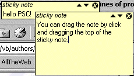

<div align="center">

## Sticky Notes\!


</div>

### Description

I know it's been done a thousand times, but how cute is post it notes on your screen. I can't imagine many people will use it, but I am!
 
### More Info
 


<span>             |<span>
---                |---
**Submitted On**   |2001-08-17 09:49:08
**By**             |[Mike Toye](https://github.com/Planet-Source-Code/PSCIndex/blob/master/ByAuthor/mike-toye.md)
**Level**          |Beginner
**User Rating**    |4.3 (26 globes from 6 users)
**Compatibility**  |VB 6\.0
**Category**       |[Complete Applications](https://github.com/Planet-Source-Code/PSCIndex/blob/master/ByCategory/complete-applications__1-27.md)
**World**          |[Visual Basic](https://github.com/Planet-Source-Code/PSCIndex/blob/master/ByWorld/visual-basic.md)
**Archive File**   |[Sticky Not248178172001\.zip](https://github.com/Planet-Source-Code/mike-toye-sticky-notes__1-26297/archive/master.zip)

### API Declarations

```
Private Declare Function SetWindowPos Lib "User32" (ByVal _
  hWnd As Long, ByVal hWndInsertAfter As Long, ByVal X As Long, _
  ByVal Y As Long, ByVal cx As Long, ByVal cy As Long, _
  ByVal wFlags As Long) As Long
Private Declare Function SendMessage Lib "User32" Alias "SendMessageA" (ByVal _
  hWnd As Long, ByVal wMsg As Long, ByVal wParam As Long, _
  lParam As Any) As Long
Private Declare Sub ReleaseCapture Lib "User32" ()
```


